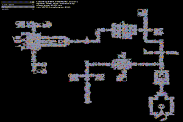

pibt2
===
[](LICENSE)

The code repository of the paper "[Priority Inheritance with Backtracking for Iterative Multi-agent Path Finding](https://kei18.github.io/pibt2/)" (AIJ-22; the journal version).

- There is [an old implementation](https://github.com/Kei18/pibt) for [the conference paper (IJCAI-19)](https://www.ijcai.org/proceedings/2019/76); this repo is much faster and cleaner.
- The implementation includes both Multi-Agent Path Finding (MAPF) and Multi-Agent Pickup and Delivery (MAPD).
- It is written in C++(17) with [CMake](https://cmake.org/) (≥v3.16) build.
- The repository uses [Google Test](https://github.com/google/googletest) and [the original library for 2D pathfinding](https://github.com/Kei18/grid-pathfinding) as git submodules.
- The visualizer uses [openFrameworks](https://openframeworks.cc) and works only on macOS (as git submodule).
- The accompanied solvers are HCA\* [1], Push and Swap [2], TP [3], and PIBT(+).

| platform | status (public) | status (dev) |
| ---: | :--- |:--- |
| macos-10.15 |   |   |
| ubuntu-latest |  |  |

Please cite the following paper if you use the code in your published research:
```
# AIJ-22

(in press)

# IJCAI-19

@inproceedings{okumura2019priority,
  title={Priority Inheritance with Backtracking for Iterative Multi-agent Path Finding},
  author={Okumura, Keisuke and Machida, Manao and D{\'e}fago, Xavier and Tamura, Yasumasa},
  booktitle={Proceedings of the Twenty-Eighth International Joint Conference on Artificial Intelligence, {IJCAI-19}},
  publisher={International Joint Conferences on Artificial Intelligence Organization},
  pages={535--542},
  year={2019},
  month={7},
  doi={10.24963/ijcai.2019/76},
  url={https://doi.org/10.24963/ijcai.2019/76}
}
```

## Demo




## Building

```sh
git clone --recursive https://github.com/Kei18/pibt2.git
cd pibt2
mkdir build && cd build
cmake ..
make
```

### Docker

You can also use the docker environment instead of the native one, based on Ubuntu18.04.

```sh
docker compose up -d
docker compose exec dev bash
```

## Usage
### MAPF
PIBT
```sh
./mapf -i ../instances/mapf/sample.txt -s PIBT -o result.txt -v
```

You can find details and explanations for all parameters with:
```sh
./mapf --help
```

Please see `instances/mapf/sample.txt` for parameters of instances, e.g., filed, number of agents, time limit, etc.

<details><summary>Output File</summary>

This is an example output of `../instances/mapf/sample.txt`.
Note that `(x, y)` denotes location.
`(0, 0)` is the left-top point.
`(x, 0)` is the location at `x`-th column and 1st row.
```
instance=../instances/mapf/sample.txt
agents=100
map_file=arena.map
solver=PIBT
solved=1
soc=3738
lb_soc=3243
makespan=68
lb_makespan=68
comp_time=11
starts=(32,21),(40,4),(20,22),(26,18), [...]
goals=(10,16),(30,21),(11,42),(44,6), [...]
solution=
0:(32,21),(40,4),(20,22),(26,18), [...]
1:(31,21),(40,5),(20,23),(27,18), [...]
[...]
```

</details>


### MAPD
PIBT
```sh
./mapd -i ../instances/mapd/sample.txt -s PIBT -o result.txt -v
```

You can find details and explanations for all parameters with:
```sh
./mapd --help
```

Please see `instances/mapd/sample.txt` for parameters of instances.

When you specify pickup and delivery locations (and non-task endpoints), put a special file in `map/`. An example is `map/warehouse.map.pd`.
The rule is the following:

- \[\@T\]: obstacles
- [psa]: pickup locations
- [dsa] delivery locations
- [ea] endpoints

<details><summary>Output File</summary>

This is an example output of `../instances/mapd/sample.txt`.

- task: {task-id}:{loc-pickup}->{loc-delivery},appear={timestep},finished={timestep}
- solution: {timestep}:(loc-current)->(loc-current-target):{assigned-task-id or -1}

```
instance=../instances/mapd/sample.txt
agents=50
map_file=warehouse.map
solver=PIBT
solved=1
service_time=25.33
makespan=535
comp_time=437
preprocessing_comp_time0
starts=(33,17),(32,19), [...]
task=
0:129->113,appear=0,finished=23
4:342->256,appear=4,finished=24
[...]
solution=
0:(33,17)->(24,3):-1,(32,19)->(24,3):-1, [...]
1:(32,17)->(29,2):-1,(31,19)->(29,2):-1, [...]
[...]
```

</details>

## Visualizer

### Building
It takes around 10 minutes.

#### macOS 10.x
```sh
bash ./visualizer/scripts/build_macos.sh
```

Note: The script of openFrameworks seems to contain bugs. Check this [issue](https://github.com/openframeworks/openFrameworks/issues/6623). I fixed this in my script :D

#### macOS 11.x
```sh
git submodule update --remote
bash ./third_party/openFrameworks/scripts/osx/download_libs.sh
cd visualizer
make build
cd ..
chmod +x ./visualize.sh
```

### Usage
```sh
cd build
../visualize.sh result.txt
```

You can manipulate it via your keyboard. See printed info.


## Experimental Environment

The experimental scripts are written in Python3.7.

| Exp | used version | scripts |
| :--- | :--- | :--- |
| MAPF | [](https://github.com/Kei18/pibt2/releases/tag/exp%2Fmapf) | `exp_scripts/mapf.py` |
| MAPD | [](https://github.com/Kei18/pibt2/releases/tag/exp%2Fmapd) | `exp_scripts/mapd.py` |


## Notes
- Maps in `maps/` are from [MAPF benchmarks](https://movingai.com/benchmarks/mapf.html).
  When you add a new map, please place it in the `maps/` directory.
- The font in `visualizer/bin/data` is from [Google Fonts](https://fonts.google.com/).
- Other baseline solvers are obtained from: [CBS](https://github.com/Jiaoyang-Li/CBSH2-RTC), [EECBS](https://github.com/Jiaoyang-Li/EECBS), and [BCP](https://github.com/ed-lam/bcp-mapf)

## Licence
This software is released under the MIT License, see [LICENSE.txt](LICENCE.txt).

## Author
[Keisuke Okumura](https://kei18.github.io) is a Ph.D. student at the Tokyo Institute of Technology, interested in controlling multiple moving agents.

## Reference
1. Silver, D. (2005). Cooperative pathfinding. Proc. AAAI Conf. on Artificial Intelligence and Interactive Digital Entertainment (AIIDE-05)
1. Luna, R., & Bekris, K. E. (2011). Push and swap: Fast cooperative path-finding with completeness guarantees. Proc. Int. Joint Conf. on Artificial Intelligence (IJCAI)
1. Ma, H., Li, J., Kumar, T. K., & Koenig, S. (2017). Lifelong multi-agent path finding for online pickup and delivery tasks. Proc. Int. Conf. on Autonomous Agents and Multiagent Systems (AAMAS)
